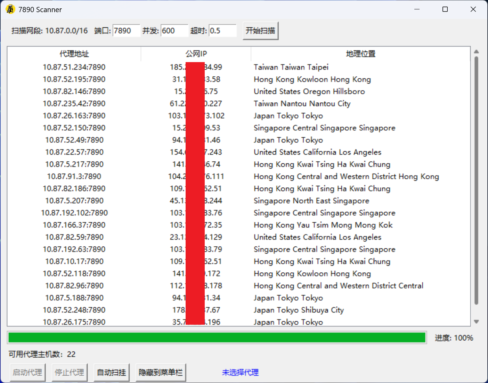

# 7890 Scanner

## 简介

7890 Scanner 是一个用于扫描本地网段（如 10.87.0.0/16）指定端口（默认 7890），并自动检测可用 HTTP 代理的工具。支持 Windows 系统代理自动设置，带有图形界面。


## 功能
- 扫描本地网段所有主机的指定端口开放情况
- 自动检测代理功能及地理位置（通过 ip-api.com）
- 支持 Windows 系统代理一键设置/取消
- 自动扫挂功能：可自动更换代理，持续检测 Google 可访问性
- 托盘图标支持，窗口可隐藏到系统托盘

## 使用方法

直接运行：
```bash
python ip.py
```
主要功能：
- 扫描网段端口开放主机
- 检测代理功能和地理位置
- 右键设为代理，一键启动/停止系统代理（仅 Windows）
- 自动扫挂，自动更换代理
- 托盘图标，窗口可隐藏

## 依赖
- Python 3.7+
- tkinter（标准库）
- pillow
- pystray

安装依赖：
```bash
pip install pillow pystray
```
